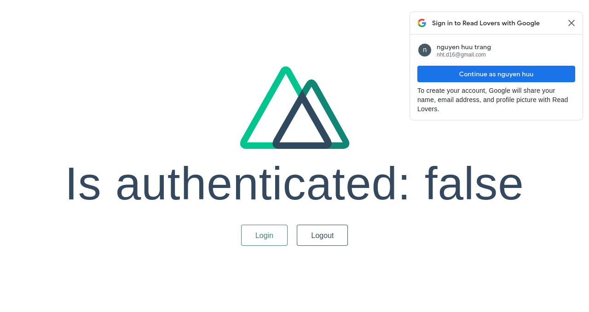

# nuxt-prototype-auth
Nuxt auth module demo:
+ Signin with email
+ Signin with facebook with callback
+ Signin with google with callback
+ Google one tap signin


## Build Setup

```bash
# install dependencies
$ yarn install

# serve with hot reload at localhost:3000
$ yarn dev

# build for production and launch server
$ yarn build
$ yarn start

# generate static project
$ yarn generate
```

## Demo
#### Signin google


#### One tap signin google

